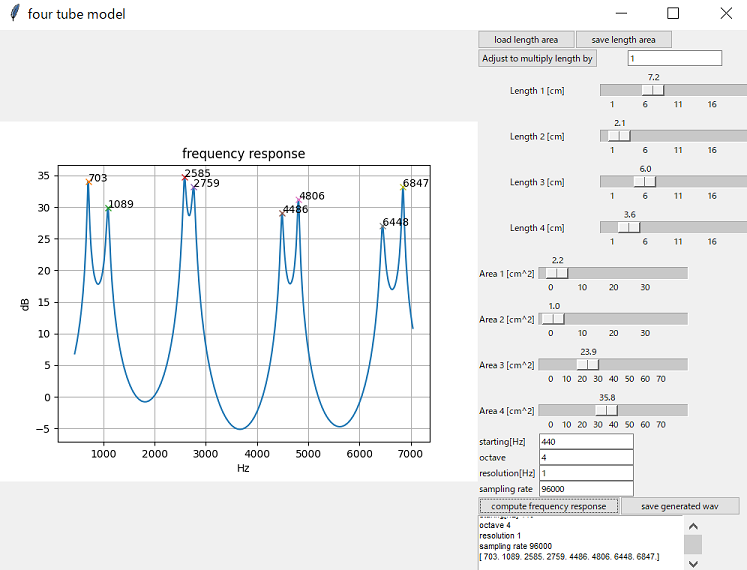

#  Tube Model GUI    

A GUI to control four tube model via tkinter.  

## usage  

python gui_main4.py  

    
  
Please refer to def process of fourtube1.py.  

## vowel sample  
Following files are japanese vowels samples and generated wav.  
a12.txt  a12.wav  
a14.txt  a14.wav  
i6.txt i6.wav  
i7.txt  i7.wav  
u11.txt  u11.wav  
u14.txt  u14.wav  
e5.txt  e5.wav  
e7.txt  e7.wav  
o7.txt  o7.wav  
You can load it by load length area button and generate wav by save generated wav button.    

## License    
MIT  
