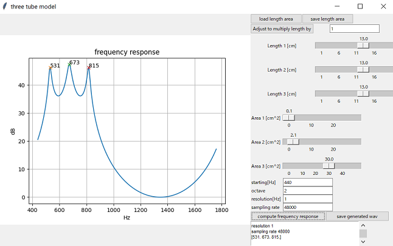

#  Tube Model GUI    

A GUI to control three tube model via tkinter.  

Regarding to a GUI to control four tube model via tkinter, see in GUI_fourtube folder.  

## usage  

python gui_main1.py  

    
  
Please refer to def process of threetube1.py.  

## License    
MIT  

